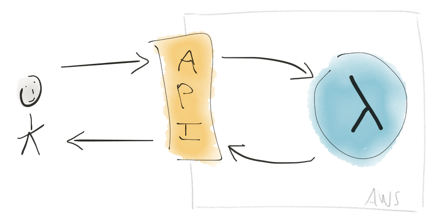
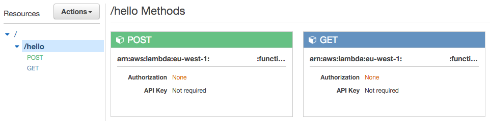

(AWS) Lambda con Terraform
=================================

Este proyecto es un ejemplo de una [Lambda](https://aws.amazon.com/lambda/) de Python (AWS) expuesta con [API Gateway](https://aws.amazon.com/api-gateway/), configurada con [Terraform](https://www.terraform.io/). Este proyecto de demostración está relacionado con la siguiente publicación de blog: [Un recorrido por AWS Lambda](https://tailordev.fr/blog/2016/07/08/a-tour-of-aws-lambda/).



## Introducción

Este proyecto de demostración crea un punto final `/hello` con dos métodos (`GET` y `POST`). Ambos métodos están vinculados a un **único archivo** que contiene dos manejadores (también conocidos como funciones lambda, uno para cada método). Esto se define mediante un parámetro `handler`. El código para cada función lambda está escrito en Python (los nombres de los métodos son solo una convención):

```python
def handler(event, context):
    return { "message": "Hello, World!" }

def post_handler(event, context):
    return { "message": "I should have created something..." }
```

La [configuración de Terraform](hello_lambda.tf) se basa en dos módulos: [`lambda`](lambda/) y [`api_method`](api_method/). Consulta la [sección de Módulos de Terraform](#módulos-de-terraform) para más información. Esta configuración crea dos funciones lambda en AWS Lambda, una API REST (desplegada) con un único punto final y dos métodos HTTP en API Gateway, y se encarga de los permisos y credenciales. La figura de abajo es un ejemplo de lo que obtienes en el panel de control de API Gateway:



## Primeros pasos


Clona este repositorio, luego ejecuta:

    $ make get

Crea un archivo `terraform.tfvars` con el contenido de abajo. Este paso es opcional ya que Terraform te pedirá que rellenes los diferentes valores, pero es conveniente.

```ini
aws_region     = "eu-west-1"
```

¡Ahora estás listo para usar Terraform!

    $ make plan

Si todo está bien, puedes construir toda la infraestructura:

    $ make apply

Puedes destruir todos los componentes ejecutando:

    $ make destroy

Para más información, por favor lee [la documentación de Terraform](https://www.terraform.io/docs/index.html).

## Módulos de Terraform

### `lambda`

```hcl
module "lambda" {
  source  = "github.com/TailorDev/hello-lambda/lambda"
  name    = "my-lambda"
  handler = "handler"
  runtime = "python2.7" # podría ser nodejs | nodejs4.3 | java8 | python2.7
  role    = "my-role"
}
```

**Importante:** este módulo asume que el archivo fuente, la lambda (en AWS), y el archivo zip tienen el **mismo nombre**. Por ejemplo, usamos `hello_lambda` en este proyecto. El parámetro `handler` distingue las diferentes funciones lambda que se pueden invocar.

### `api_method`

```hcl
module "hello_post" {
  source      = "github.com/TailorDev/hello-lambda/api_method"
  rest_api_id = "rest-api-id"
  resource_id = "resource-id"
  method      = "POST"
  path        = "resource-path"
  lambda      = "my-lambda"
  region      = "eu-west-1"
  account_id  = "account-id"
}
```